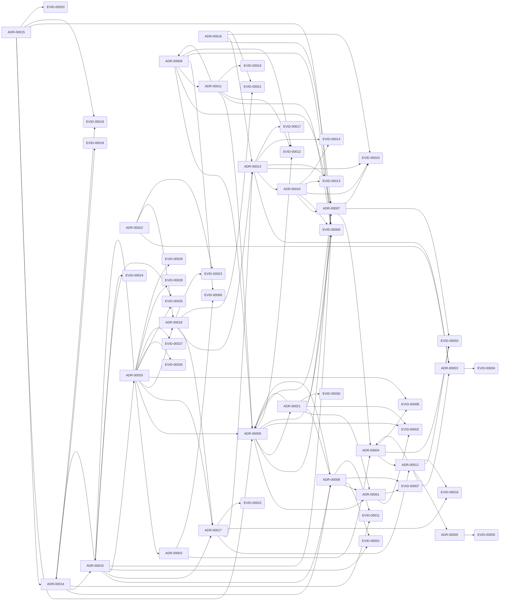

<!-- Generated by .github/scripts/build-graph.py — DO NOT EDIT BY HAND. -->
<!-- 再生成: python3 .github/scripts/build-graph.py -->

# GRAPH

知識ベースの参照グラフと、構造化レビューのための信号。
辺はすべてリポジトリ内の明示的なメタデータ由来で、推論は含まない（[ADR-010](adr/00010-knowledge-graph-layers.md)）。
このファイルは生成物であり、手で編集しない。読み方は [PB-010](playbook/00010-review-with-graph.md)。

## 概要

| 区分 | 件数 |
| --- | --- |
| ノード: adr | 22 |
| ノード: claim | 30 |
| ノード: evidence | 30 |
| ノード: external | 3 |
| ノード: ledger | 4 |
| ノード: open-question | 34 |
| ノード: playbook | 19 |
| ノード: reviews | 7 |
| ノード: root | 5 |
| ノード: skill | 13 |
| 辺: anchor | 61 |
| 辺: entrypoint | 13 |
| 辺: links | 734 |
| 辺: related | 275 |
| ノード合計 | 167 |
| 辺合計 | 1083 |

## 根拠グラフ（決定と根拠）

ADR がどの evidence に支えられ、決定同士がどうつながるか。矢印は `related` 由来。

## ハブ（被参照が多い文書）

| ID | 被参照 | 参照 | タイトル |
| --- | --- | --- | --- |
| ADR-00008 | 38 | 16 | SDD の spec 成果物と知識ベースを、双方向の受け渡しで接続する |
| ADR-00006 | 37 | 17 | 文脈を Tier 0〜3 に分け、ロード順を固定する |
| ADR-00019 | 33 | 27 | 働き方の kernel と案件の考え方を別権威にし、evidence は下書きから入る |
| ADR-00012 | 29 | 14 | レビュー証跡を文書から分離し、実効レビュー日で鮮度を判定する |
| ADR-00010 | 27 | 18 | 知識グラフを構造層と意味層に分け、構造層だけを CI に置く |
| LEDGER-OQ | 27 | 0 | Open questions |
| ADR-00014 | 26 | 19 | 実装スペックを契約・決定・振る舞いに分け、不可逆な箇所にだけ設計を残す |
| ADR-00013 | 25 | 19 | 検査を error と warning に等級分けし、充足しているものから機械で固定する |
| ADR-00020 | 25 | 32 | 認証は git の外の IdP、git は認証情報を使わず、PF は汎用クライアントとする |
| EVID-00009 | 25 | 7 | 文脈は有限予算であり、常時ロードは劣化を招く |

## レビュー信号

| 種別 | 対象 | 指摘 |
| --- | --- | --- |
| 入口のない手順 | PB-00004 | 専用の skill 入口がなく発見されにくい |
| 入口のない手順 | PB-00005 | 専用の skill 入口がなく発見されにくい |
| 入口のない手順 | PB-00006 | 専用の skill 入口がなく発見されにくい |
| 入口のない手順 | PB-00009 | 専用の skill 入口がなく発見されにくい |
| 入口のない手順 | PB-00011 | 専用の skill 入口がなく発見されにくい |
| 入口のない手順 | PB-00016 | 専用の skill 入口がなく発見されにくい |
| 手順のない決定 | ADR-00022 | この決定を実行する playbook がない |

警告は CI を落とさない。次のレビューで扱う候補として出している。
エラーになる検査と、警告に留める基準は [ADR-013](adr/013-check-grades.md)。

根拠節と `related` の突き合わせは frozen 4 件を対象外にしている（ADR-00001, ADR-00002, ADR-00003, ADR-00005）。

## 未解決の問い

| ID | 内容 |
| --- | --- |
| OQ-00001 | 90 日の鮮度窓をドメイン別に短縮する必要があるか？（初期は一律 90） |
| OQ-00002 | frozen → deprecated 遷移を CI 例外としてどう安全に扱うか？（現状は owners 承認の明示 PR） |
| OQ-00004 | Tier 0 / Tier 1 の総量に上限（行数またはトークン）を設けるか？（現状は上限なし。増やすときは ADR で合意） |
| OQ-00005 | 生成物 `INDEX.md` をリポジトリに置き続けるか、CI 生成に切り替えるか？（現状は差分レビュー可能性を優先して commit する） |
| OQ-00007 | SDD の「昇格するか」の判断を機械支援できるか？（現状は PB-00008 の質問リストによる人間判断） |
| OQ-00009 | 意味グラフ（Graphify 等）を定期的に回して探索する運用を作るか？（現状は任意のローカル探索のみ。ADR-00010） |
| OQ-00010 | 構造グラフを `graph.json` としても出力し、外部ツール（Neo4j / Gephi / Obsidian）に渡せるようにするか？ |
| OQ-00011 | Windows で `core.symlinks` が無効な checkout では `.claude/skills/` の鏡がテキストファイルになる。Claude Code 側の `/import` に任せるか、複製へ切り替えるか？（現状は symlink 前提。adr:ADR-00011） |
| OQ-00012 | Codex / Claude Code での実動作を CI か手順で検証する手段を持つか？（Codex / Claude Code とも実機での skill 発火を 2026-08-09 に確認済み。REV-00005。CI 化の手段は未決。evidence:EVID-00015） |
| OQ-00014 | staleness / index の検査を fixture テスト付きの単一検証器へ統合するか？ ADR-00012 で schedule 実行・未来日拒否・macOS 動作は解消した。**残りは status 列挙・ID とファイル名の整合・base 欠落時の失敗（現状は警告してスキップ）・回帰を守る fixture テスト**（evidence:EVID-00016） |
| OQ-00015 | evidence の証拠能力を区別するメタデータ（source type / observed_at / confidence / 支持と反証の別）を導入するか？（現状の参照グラフは参照の存在のみを検査し、支持・反証・単なる関連を区別しない。adr:ADR-00010） |
| OQ-00017 | AIDD の効果（関連文書検索の成功率・手戻り・レビュー時間・グラフ警告の有効率）を実プロジェクトで測定するか？（測定なしに知識表現を増やすと文書官僚制化する懸念。REV-00005） |
| OQ-00018 | 期限日の集中をどう散らすか？ 全文書の `last_reviewed` が 2026-08-08/09 に集中しており、期限も 2 日に集中する。週次 `schedule` の下では、その週に main が 40 件超のエラーで赤くなる（証跡を計画的に分散する運用で緩和できるが、仕組みはない。adr:ADR-00012 REV-00006） |
| OQ-00019 | 規範文書に散らばる手書きの表（Tier 表が README / CONVENTIONS / GUIDE、ツール対応表が AGENTS / README / GUIDE）を単一の出所にするか？ 生成インデックスと同じ腐り方をする（evidence:EVID-00010 REV-00006） |
| OQ-00020 | frozen 文書は根拠節と `related` の突き合わせから外れる。ADR-00002 のズレ（EVID-00003）をどう解消するか？（後継 ADR を作るか、frozen を解くか。adr:ADR-00013） |
| OQ-00022 | 受け入れ例の粒度と網羅の目安をどう決めるか？（例が多すぎるとテストが遅く、少ないと解釈が入る。adr:ADR-00014） |
| OQ-00023 | 意味グラフの提案を `related` へ焼き込む作業を、誰がどの頻度で回すか？（現状は運用未定。adr:ADR-00013） |
| OQ-00024 | 台帳を towncrier 方式の断片ファイルへ分割するか？ 現状は `merge=union` で行競合を消しているが、重複 ID は残りうる。分割すると 1 ファイル grep の利点が消える（evidence:EVID-00021 adr:ADR-00016） |
| OQ-00025 | レビュー判定を日付から Doorstop 方式の指紋（内容ハッシュ）へ移すか？ 本文を変えずに日付だけ進める操作を機械的に検出できるようになるが、`frozen` 文書は指紋を本体に書けないため証跡側に持つ設計が要る（evidence:EVID-00022 adr:ADR-00017） |
| OQ-00026 | 未着地の PR 同士の ID 衝突を、機械的に決着させる規約を置くか？（PR 番号の大小で譲る側を決めれば error に昇格できるが、GitHub API への依存が入り、オフラインで走る現在の検査の性質が変わる。evidence:EVID-00023 adr:ADR-00018） |
| OQ-00027 | 並行度が上がっても連番を維持できるか？ 現在は「1 PR ずつ・main を base」で衝突窓を短く保っているだけで、同時に 5 本以上開く運用は試していない。破綻したら採番方式そのもの（スラッグ / 外部番号）を選び直す必要があり、`frozen` 文書の扱いが論点になる（evidence:EVID-00023 adr:ADR-00003 ADR-00018） |
| OQ-00028 | UI デザイン成果物（Figma・Design System・画面状態）の正本と KB / 案件 ADR の境界を、専用 ADR として固定するか？（現状は ADR-00014 の契約・決定・振る舞い分解を UI に当てた適用指針のみ。playbook:PB-00016） |
| OQ-00029 | 散在ソース（Slack / Google Meet / Confluence）の取得を MCP や API 連携にするか、人間が本文を渡す貼り付け運用に留めるか？（現状は PB-00018 が貼り付け前提。コネクタは PF 側。認証情報は git に置かない。evidence:EVID-00025 EVID-00027 EVID-00028 adr:ADR-00020 REV-00007） |
| OQ-00032 | アカウント由来の原文を、個人下書き・案件 KB・kernel のどの層まで昇格してよいか？（ADR-00020 は kernel 直書きを禁じた。案件層の扱いと、削除・権限剥奪の伝播は未決。evidence:EVID-00027 adr:ADR-00020 REV-00007） |
| OQ-00033 | 実行ワークフロー（担当・待ち・ACL ゲート）の状態をどこに置くか？ PF 側の状態機械、GitHub Issue/PR、書かない、のどれか。playbook に状態を持たせる案は ADR-00020 が今は採らない（evidence:EVID-00008 adr:ADR-00017 ADR-00020 REV-00007） |
| OQ-00034 | PF が git に PR を出すときの GitHub 主体は何か？ IdP ユーザーに紐づく GitHub App の代行か、共通サービスアカウントか。認証情報は git に置かない前提で決める。特定 IdP 名には固定しない（evidence:EVID-00028 EVID-00029 adr:ADR-00020 REV-00007） |

