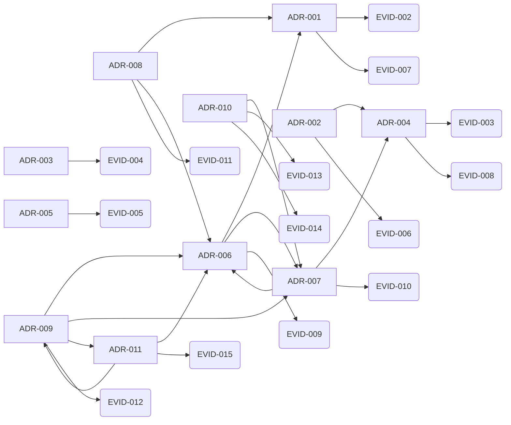

<!-- Generated by .github/scripts/build-graph.py — DO NOT EDIT BY HAND. -->
<!-- 再生成: python3 .github/scripts/build-graph.py -->

# GRAPH

知識ベースの参照グラフと、構造化レビューのための信号。
辺はすべてリポジトリ内の明示的なメタデータ由来で、推論は含まない（[ADR-010](adr/010-knowledge-graph-layers.md)）。
このファイルは生成物であり、手で編集しない。読み方は [PB-010](playbook/010-review-with-graph.md)。

## 概要

| 区分 | 件数 |
| --- | --- |
| ノード: adr | 11 |
| ノード: claim | 15 |
| ノード: evidence | 16 |
| ノード: external | 1 |
| ノード: ledger | 3 |
| ノード: open-question | 17 |
| ノード: playbook | 10 |
| ノード: reviews | 5 |
| ノード: root | 4 |
| ノード: skill | 6 |
| 辺: anchor | 29 |
| 辺: entrypoint | 6 |
| 辺: links | 247 |
| 辺: related | 102 |
| ノード合計 | 88 |
| 辺合計 | 384 |

## 根拠グラフ（決定と根拠）

ADR がどの evidence に支えられ、決定同士がどうつながるか。矢印は `related` 由来。

## ハブ（被参照が多い文書）

| ID | 被参照 | 参照 | タイトル |
| --- | --- | --- | --- |
| ADR-006 | 23 | 13 | 文脈を Tier 0〜3 に分け、ロード順を固定する |
| ROOT-CONVENTIONS | 18 | 12 | CONVENTIONS.md |
| ADR-007 | 16 | 11 | INDEX.md を生成物とし、CI で最新性を強制する |
| ADR-010 | 16 | 16 | 知識グラフを構造層と意味層に分け、構造層だけを CI に置く |
| LEDGER-OQ | 16 | 0 | Open questions |
| ADR-004 | 14 | 6 | 鮮度は last_reviewed の 90 日と変更時同期で守る |
| ADR-011 | 14 | 14 | skills と規範をツール横断にし、正本を 1 か所に置く |
| ADR-009 | 13 | 11 | skills は playbook の入口とし、手順を二重に持たない |
| PB-003 | 12 | 3 | レビューサイクルを回す |
| ADR-001 | 11 | 6 | リポジトリを evidence / adr / playbook / ledger / reviews に分割する |

## レビュー信号

| 種別 | 対象 | 指摘 |
| --- | --- | --- |
| 入口のない手順 | PB-004 | 専用の skill 入口がなく発見されにくい |
| 入口のない手順 | PB-005 | 専用の skill 入口がなく発見されにくい |
| 入口のない手順 | PB-006 | 専用の skill 入口がなく発見されにくい |
| 入口のない手順 | PB-009 | 専用の skill 入口がなく発見されにくい |
| 未使用の根拠 | EVID-016 | どの決定・主張からも参照されていない |

警告は CI を落とさない。次のレビューで扱う候補として出している。

## 未解決の問い

| ID | 内容 |
| --- | --- |
| OQ-001 | 90 日の鮮度窓をドメイン別に短縮する必要があるか？（初期は一律 90） |
| OQ-002 | frozen → deprecated 遷移を CI 例外としてどう安全に扱うか？（現状は owners 承認の明示 PR） |
| OQ-004 | Tier 0 / Tier 1 の総量に上限（行数またはトークン）を設けるか？（現状は上限なし。増やすときは ADR で合意） |
| OQ-005 | 生成物 `INDEX.md` をリポジトリに置き続けるか、CI 生成に切り替えるか？（現状は差分レビュー可能性を優先して commit する） |
| OQ-007 | SDD の「昇格するか」の判断を機械支援できるか？（現状は PB-008 の質問リストによる人間判断） |
| OQ-008 | `GRAPH.md` の警告（未使用の根拠・根拠なしの決定など）を、いつ CI エラーへ昇格させるか？（現状はすべて警告のまま） |
| OQ-009 | 意味グラフ（Graphify 等）を定期的に回して探索する運用を作るか？（現状は任意のローカル探索のみ。ADR-010） |
| OQ-010 | 構造グラフを `graph.json` としても出力し、外部ツール（Neo4j / Gephi / Obsidian）に渡せるようにするか？ |
| OQ-011 | Windows で `core.symlinks` が無効な checkout では `.claude/skills/` の鏡がテキストファイルになる。Claude Code 側の `/import` に任せるか、複製へ切り替えるか？（現状は symlink 前提。adr:ADR-011） |
| OQ-012 | Codex / Claude Code での実動作を CI か手順で検証する手段を持つか？（Codex / Claude Code とも実機での skill 発火を 2026-08-09 に確認済み。REV-005。CI 化の手段は未決。evidence:EVID-015） |
| OQ-013 | frozen・90 日鮮度・reviews 追記のライフサイクル矛盾をどう解消するか？ レビュー証跡を文書本体から分離し effective freshness を導出する方式（ADR-012 候補）を設計する。**2026-11-07 に現行 frozen 文書が修復不能な期限切れになるため期限付き**（evidence:EVID-016） |
| OQ-014 | staleness / index の検査を fixture テスト付きの単一検証器へ統合するか？ schedule 実行・未来日拒否・status 列挙・ID とファイル名の整合・base 欠落時の失敗・macOS 動作を含める。schedule 追加は OQ-013 の解消後に行う（evidence:EVID-016） |
| OQ-015 | evidence の証拠能力を区別するメタデータ（source type / observed_at / confidence / 支持と反証の別）を導入するか？（現状の参照グラフは参照の存在のみを検査し、支持・反証・単なる関連を区別しない。adr:ADR-010） |
| OQ-016 | 他プロジェクトへコピーして使う初期化手段（core / project の二層分離、owner・日付・ライセンスの初期化）を作るか？ それとも「AIDD Knowledge Base Template」として製品境界を名称で限定するか？（REV-005） |
| OQ-017 | AIDD の効果（関連文書検索の成功率・手戻り・レビュー時間・グラフ警告の有効率）を実プロジェクトで測定するか？（測定なしに知識表現を増やすと文書官僚制化する懸念。REV-005） |

