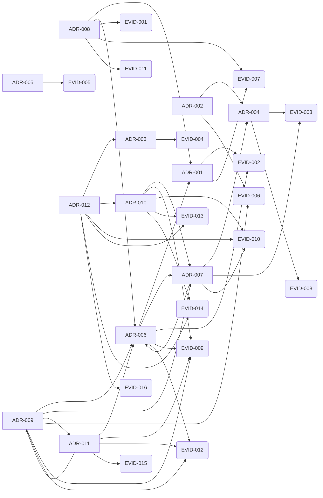

<!-- Generated by .github/scripts/build-graph.py — DO NOT EDIT BY HAND. -->
<!-- 再生成: python3 .github/scripts/build-graph.py -->

# GRAPH

知識ベースの参照グラフと、構造化レビューのための信号。
辺はすべてリポジトリ内の明示的なメタデータ由来で、推論は含まない（[ADR-010](adr/010-knowledge-graph-layers.md)）。
このファイルは生成物であり、手で編集しない。読み方は [PB-010](playbook/010-review-with-graph.md)。

## 概要

| 区分 | 件数 |
| --- | --- |
| ノード: adr | 12 |
| ノード: claim | 16 |
| ノード: evidence | 16 |
| ノード: external | 1 |
| ノード: ledger | 3 |
| ノード: open-question | 14 |
| ノード: playbook | 11 |
| ノード: reviews | 4 |
| ノード: root | 4 |
| ノード: skill | 6 |
| 辺: anchor | 31 |
| 辺: entrypoint | 6 |
| 辺: links | 264 |
| 辺: related | 115 |
| ノード合計 | 87 |
| 辺合計 | 416 |

## 根拠グラフ（決定と根拠）

ADR がどの evidence に支えられ、決定同士がどうつながるか。矢印は `related` 由来。

## ハブ（被参照が多い文書）

| ID | 被参照 | 参照 | タイトル |
| --- | --- | --- | --- |
| ADR-006 | 23 | 15 | 文脈を Tier 0〜3 に分け、ロード順を固定する |
| ADR-010 | 21 | 18 | 知識グラフを構造層と意味層に分け、構造層だけを CI に置く |
| LEDGER-OQ | 17 | 0 | Open questions |
| ROOT-CONVENTIONS | 17 | 14 | CONVENTIONS.md |
| ADR-007 | 16 | 12 | INDEX.md を生成物とし、CI で最新性を強制する |
| ADR-009 | 13 | 13 | skills は playbook の入口とし、手順を二重に持たない |
| ADR-011 | 13 | 16 | skills と規範をツール横断にし、正本を 1 か所に置く |
| EVID-009 | 12 | 7 | 文脈は有限予算であり、常時ロードは劣化を招く |
| EVID-010 | 12 | 9 | 手書き目次は腐るが、生成物なら差分で腐敗を検出できる |
| EVID-014 | 12 | 7 | 知識ベースの参照グラフは既存メタデータから決定的に導出できる |

## レビュー信号

| 種別 | 対象 | 指摘 |
| --- | --- | --- |
| 入口のない手順 | PB-004 | 専用の skill 入口がなく発見されにくい |
| 入口のない手順 | PB-005 | 専用の skill 入口がなく発見されにくい |
| 入口のない手順 | PB-006 | 専用の skill 入口がなく発見されにくい |
| 入口のない手順 | PB-009 | 専用の skill 入口がなく発見されにくい |
| 入口のない手順 | PB-011 | 専用の skill 入口がなく発見されにくい |

警告は CI を落とさない。次のレビューで扱う候補として出している。
エラーになる検査と、警告に留める基準は [ADR-012](adr/012-check-grades.md)。

根拠節と `related` の突き合わせは frozen 4 件を対象外にしている（ADR-001, ADR-002, ADR-003, ADR-005）。

## 未解決の問い

| ID | 内容 |
| --- | --- |
| OQ-001 | 90 日の鮮度窓をドメイン別に短縮する必要があるか？（初期は一律 90） |
| OQ-002 | frozen → deprecated 遷移を CI 例外としてどう安全に扱うか？（現状は owners 承認の明示 PR） |
| OQ-004 | Tier 0 / Tier 1 の総量に上限（行数またはトークン）を設けるか？（現状は上限なし。増やすときは ADR で合意） |
| OQ-005 | 生成物 `INDEX.md` をリポジトリに置き続けるか、CI 生成に切り替えるか？（現状は差分レビュー可能性を優先して commit する） |
| OQ-007 | SDD の「昇格するか」の判断を機械支援できるか？（現状は PB-008 の質問リストによる人間判断） |
| OQ-009 | 意味グラフ（Graphify 等）を定期的に回して探索する運用を作るか？（現状は任意のローカル探索のみ。ADR-010） |
| OQ-010 | 構造グラフを `graph.json` としても出力し、外部ツール（Neo4j / Gephi / Obsidian）に渡せるようにするか？ |
| OQ-011 | Windows で `core.symlinks` が無効な checkout では `.claude/skills/` の鏡がテキストファイルになる。Claude Code 側の `/import` に任せるか、複製へ切り替えるか？（現状は symlink 前提。adr:ADR-011） |
| OQ-012 | Codex / Claude Code での実動作を CI か手順で検証する手段を持つか？（現状は公式ドキュメント準拠の未検証前提。evidence:EVID-015） |
| OQ-013 | frozen 文書は根拠節と `related` の突き合わせから外れる。ADR-002 のズレ（EVID-003）をどう解消するか？（後継 ADR を作るか、frozen を解くか。adr:ADR-012） |
| OQ-014 | 意味グラフの提案を `related` へ焼き込む作業を、誰がどの頻度で回すか？（現状は運用未定。adr:ADR-012） |

