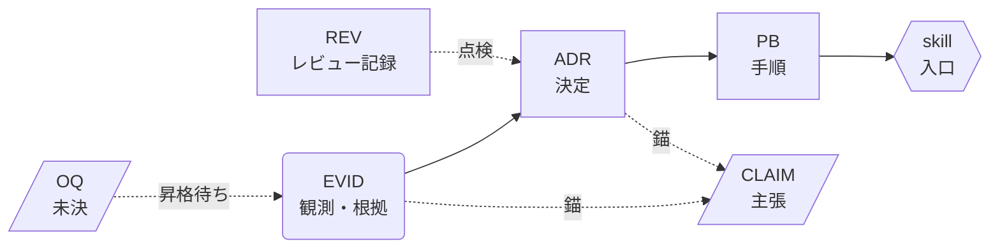
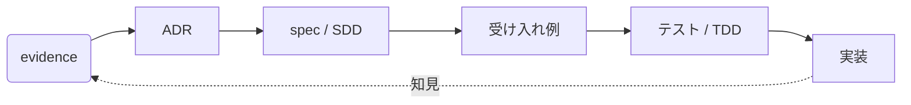
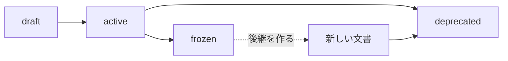

# GUIDE — 文書コード体系とリレーション

この知識ベースの**読み方と書き分け**の案内。人の始め方（最低限の利用と、改善できる理解）は [SETUP.md](SETUP.md)。守るべき規則そのものは [CONVENTIONS.md](CONVENTIONS.md)、現在の文書一覧は [INDEX.md](INDEX.md)、参照関係の実データは [GRAPH.md](GRAPH.md) にある。ここは「どれがどれで、どうつながっているか」を人が理解するための地図である。

## 1. 全体像

知識は 4 種類の文書に分かれ、一方向に積み上がる。

読み方は「**何が分かっているか（EVID）→ 何を決めたか（ADR）→ どうやるか（PB）→ どう見つけるか（skill）**」。CLAIM は横断索引、OQ は未決の置き場、REV は監査証跡である。

## 2. コード体系

| 接頭辞 | 種類 | 置き場所 | 答える問い | 例 |
| --- | --- | --- | --- | --- |
| `EVID` | evidence（観測・根拠） | `evidence/NNN-slug.md` | 何が分かっているか | EVID-00009 文脈は有限予算 |
| `ADR` | 決定 | `adr/NNN-slug.md` | 何を決めたか、なぜか | ADR-00006 Tier でロード順を固定 |
| `PB` | playbook（手順） | `playbook/NNN-slug.md` | どうやるか | PB-00006 Tier を割り当てる |
| `REV` | レビュー記録 | `reviews/NNN-slug.md` | いつ誰が点検したか | REV-00003 初回グラフレビュー |
| `CLAIM` | 主張 | `ledger/claims.md` の 1 行 | 今どこまで言えるか | CLAIM-00009 |
| `OQ` | 未決の問い | `ledger/open-questions.md` の 1 行 | まだ決められないこと | OQ-00011 |
| `LEDGER-*` | 台帳そのもの | `ledger/*.md` | 索引と証跡 | LEDGER-CLAIMS / LEDGER-ATTESTATIONS |
| `ROOT-*` | ルート文書 | `AGENTS.md` など | 規範・入口 | ROOT-AGENTS |
| （skill 名） | エージェントの入口 | `.agents/skills/<name>/SKILL.md` | いつこの手順を出すか | aidd-add-evidence |

`NNNNN` はゼロ埋め 5 桁の連番で、**欠番を埋め直さない**（一度使った番号は再利用しない）。slug は英小文字ケバブケース。ID は本文中でそのまま参照でき、`related` や claims の錨もこの ID で書く。

## 3. リレーション（どうつながるか）

辺は 4 種類だけで、すべてファイルに明示的に書かれている。推論は含まない（[ADR-00010](adr/00010-knowledge-graph-layers.md)）。

| つながり | 書き方 | 例 |
| --- | --- | --- |
| 関連 | Frontmatter の `related:` に ID を列挙 | ADR-00006 の `related: [EVID-00009, ADR-00001]` |
| 置き換え | `supersedes` / `superseded_by` | 後継 ADR が旧 ADR を置き換える |
| 引用 | 本文の Markdown リンク | ADR-00006 本文から evidence への相対リンク |
| 錨 | claims の行末 | `— evidence:EVID-00009 adr:ADR-00006` |
| 入口 | skill の `metadata.aidd-playbook` | `aidd-add-evidence` → `PB-00001` |

`related` は**非対称でよい**。playbook は実装対象の ADR を指すが、ADR 側が全 playbook を列挙する必要はない。

実際の参照数・ハブ・切れたリンクは [GRAPH.md](GRAPH.md) が生成する。

## 4. 開発ループ（SDD → TDD）

知識は開発を駆動する。SDD で仕様を決め、TDD でテストを先に書いて実装する。§1 の文書の積み上がり（EVID→ADR→PB）とは別に、開発は循環する。

| フェーズ | 何をするか | 使う手順 |
| --- | --- | --- |
| 根拠を集める | 観測・計測・引用を evidence に置く | [PB-00001](playbook/00001-add-evidence.md) |
| 決定する | evidence を根拠に ADR で選択を固定する | [PB-00002](playbook/00002-write-adr.md) |
| 仕様を書く（SDD） | requirements / design / tasks を spec 側に書く。KB から前提を引用する | [PB-00008](playbook/00008-bridge-sdd-spec.md) |
| 受け入れ例まで詰める | PdO の要件をエージェントが問い、PdO が決める往復で具体値・境界・反例にする | [PB-00020](playbook/00020-refine-acceptance-from-design.md) |
| テストを起こす（TDD） | ビジネススペックの具体例から外側のテストを書く | [PB-00013](playbook/00013-start-tdd-from-examples.md) |
| 実装する | 失敗するテスト → 通す → 整える。タスク・担当・コミット・PR は規約どおり、モデル階層と文脈はタスクごとに選ぶ | [PB-00022](playbook/00022-run-work-units-from-acceptance.md) / [PB-00023](playbook/00023-set-up-language-tdd-loop.md) / [PB-00024](playbook/00024-choose-model-effort-context.md) |
| 知見を戻す | 他案件でも繰り返す知見を evidence / ADR として KB に還流する | [PB-00008](playbook/00008-bridge-sdd-spec.md) 方向 B |

AI がない既存プロジェクトでも、evidence と ADR から段階的に始められる（[PB-00017](playbook/00017-apply-kernel-to-project.md)）。

## 5. 何を書けばいいか（判断表）

| 手元にあるもの | 書くもの | 使う手順 |
| --- | --- | --- |
| 観測・計測・引用 | `evidence/` | [PB-00001](playbook/00001-add-evidence.md) |
| 選択肢から 1 つに決めた | `adr/` | [PB-00002](playbook/00002-write-adr.md) |
| 繰り返す作業 | `playbook/` | [CONVENTIONS.md](CONVENTIONS.md) |
| 手順が見つけてもらえない | skill | [PB-00009](playbook/00009-add-skill.md) |
| 詳細設計をどこまで書くか迷う | 決定だけ `adr/`、他は書かない | [PB-00012](playbook/00012-triage-implementation-spec.md) |
| PdO の要件（ビジネススペック）はあるが受け入れ条件が曖昧 | 受け入れ例（案件リポ。質問→回答→反映の有限回） | [PB-00020](playbook/00020-refine-acceptance-from-design.md) |
| 実装に入る前に正しさを固定したい | テスト（文書は作らない） | [PB-00013](playbook/00013-start-tdd-from-examples.md) |
| DB / インフラの前提を渡したい | 制約は `adr/`、状態は渡さない | [PB-00014](playbook/00014-hand-infra-context.md) |
| 大規模で複数機能を同時に出す置き場がイメージできない | 案件リポと KB の分担図を置く | [PB-00016](playbook/00016-large-project-usage-map.md) |
| 決められない・情報が足りない | `ledger/open-questions.md` | — |
| 点検した記録 | `reviews/` | [PB-00003](playbook/00003-run-review-cycle.md) |
| 外部 spec からの持ち帰り | 上のいずれか（昇格判断つき） | [PB-00008](playbook/00008-bridge-sdd-spec.md) |
| このワークフローの始め方・セットアップ | 案内を読む（規範は書かない） | [SETUP.md](SETUP.md) / [PB-00019](playbook/00019-onboard-with-setup-guide.md) |
| 新しいリポジトリへ適用する | kernel は残し、案件 ADR と混ぜない | [PB-00017](playbook/00017-apply-kernel-to-project.md) |
| SDD で動く spec リポに Jira / Confluence ごと組み込む | 案件 `AGENTS.md`（雛形）と雛形 2 つ、CI の検査 | [PB-00021](playbook/00021-embed-workflow-in-spec-repo.md) |
| kernel 自体の次の仕事を知りたい | `ledger/roadmap.md`（順序と完了条件。期日なし） | — |
| Slack / 議事録 / Confluence が散らばっている | `draft` の evidence（確認後に `active`） | [PB-00018](playbook/00018-draft-evidence-from-sources.md) |
| AIDD の前に置く PF / ログイン ACL を足したくなった | 認証は git の外の IdP。製品名は kernel に固定しない | [ADR-00020](adr/00020-platform-is-a-client.md) |

迷ったときの原則は 3 つ。**根拠のない決定を書かない**（先に evidence）。**このプロジェクト固有の詳細を持ち込まない**（他でも同じ判断を繰り返すものだけ）。**働き方の決定と案件の考え方を同じ一覧に置かない**（[ADR-00019](adr/00019-kernel-and-project-layers.md)）。

本リポジトリは働き方の **kernel** である。新しい案件へ適用するときは ADR を丸コピーせず、案件リポ側にその製品の `adr/` を置く。Slack や議事録から根拠を起こすときは下書き（`draft`）までがエージェント、確定は人間である。

## 6. ライフサイクル

| status | 意味 | 変更 |
| --- | --- | --- |
| `draft` | 草案 | 自由 |
| `active` | 現行 | 自由 |
| `frozen` | 契約として固定 | **不可**。後継を新規作成する |
| `deprecated` | 廃止 | 後継リンクの整備のみ |

どの status でも、レビューから 90 日を超えると CI が落ちる。記録の付け方は 2 通りある。

- **本文を直した**: 同じコミットで `last_reviewed` を今日（UTC）にする
- **読んだが直す必要がなかった**: `ledger/attestations.md` に `- 日付 ID 確認者 — 確認内容` を 1 行追記する

鮮度はこの 2 つのうち**新しい方**（実効レビュー日）で測る。`frozen` は本文を触れないので、後者だけがレビュー手段になる（[ADR-00012](adr/00012-review-attestations.md)）。`reviews/` と `ledger/attestations.md` 自体は履歴なので期限の対象外。

## 7. 読む順（Tier）

| Tier | いつ読むか | 何を |
| --- | --- | --- |
| 0 | 毎回、全文 | [AGENTS.md](AGENTS.md) / [CONVENTIONS.md](CONVENTIONS.md) |
| 1 | 毎回、一覧だけ | [INDEX.md](INDEX.md) / [GRAPH.md](GRAPH.md) / [SETUP.md](SETUP.md) / このファイル / `ledger/` / skill の説明文 |
| 2 | 作業が決まったら | `adr/` / `playbook/` |
| 3 | 根拠を疑うとき | `evidence/` / `reviews/` |

Tier は重要度ではなく**ロードのタイミング**を表す（[ADR-00006](adr/00006-context-tiers.md)）。

## 8. 一本の例で辿る

「文脈を Tier で分ける」という判断が、どう文書化されたか。

1. **EVID-00009** — 文脈は有限予算で、常時ロードは劣化を招くという観測を書いた
2. **ADR-00006** — その根拠に基づき Tier 0〜3 とロード順を決めた（`related: EVID-00009`）
3. **PB-00006** — Tier の割り当てと見直しの手順にした
4. **CLAIM-00009** — 「読む順序を Tier で固定する」を主張として台帳に載せ、`evidence:EVID-00009 adr:ADR-00006` を錨にした
5. **INDEX.md** — 各文書の Tier 列に反映された
6. **GRAPH.md** — ADR-00006 が被参照の最も多いハブとして現れる（数値は再生成のたびに変わる）

逆から辿ることもできる。GRAPH.md でハブを見つけ、INDEX.md で位置を確認し、ADR を読み、その錨の evidence まで降りる。

## 9. どのツールから使うか

正本は 1 か所に置き、読まないツールにだけ橋を架けている（[ADR-00011](adr/00011-cross-tool-agent-integration.md)）。

| ツール | 規範 | skill |
| --- | --- | --- |
| Codex | `AGENTS.md` | `.agents/skills/` |
| Cursor | `AGENTS.md` | `.agents/skills/` |
| Claude Code | `CLAUDE.md`（`@AGENTS.md` の 1 行） | `.claude/skills/`（正本への symlink） |

skill の中身と規範の中身はどのツールでも同一である。ツールごとに書き分けない。

## 10. 生成物

| ファイル | 中身 | 再生成 |
| --- | --- | --- |
| [INDEX.md](INDEX.md) | 全文書の ID・status・Tier・鮮度 | `bash .github/scripts/build-index.sh` |
| [GRAPH.md](GRAPH.md) | 参照グラフとレビュー信号 | `python3 .github/scripts/build-graph.py` |

どちらも手で編集しない。直すのは元の文書側で、**グラフ → 索引**の順に再生成する。
