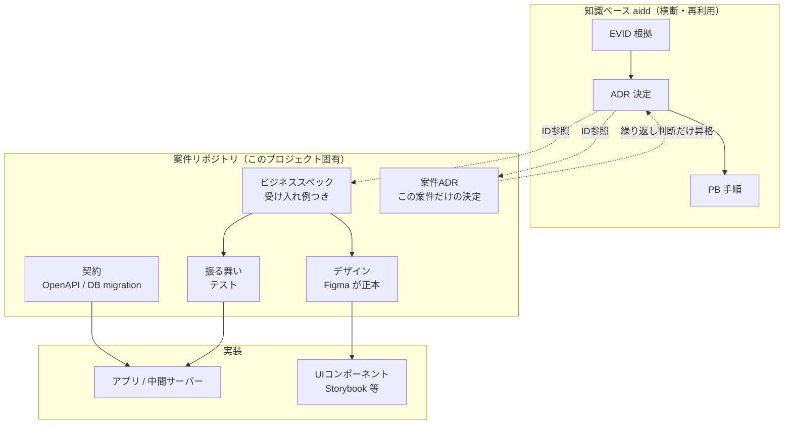
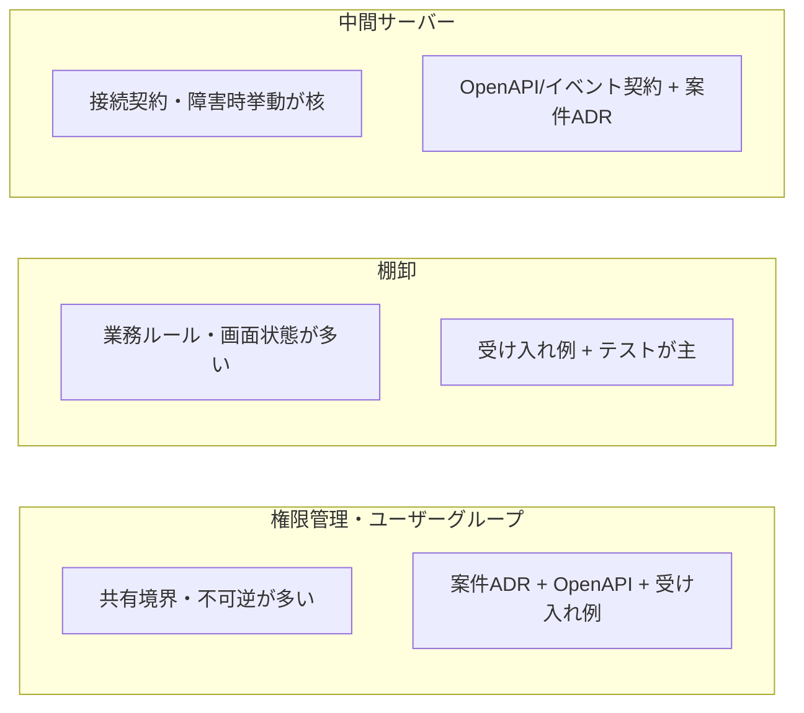
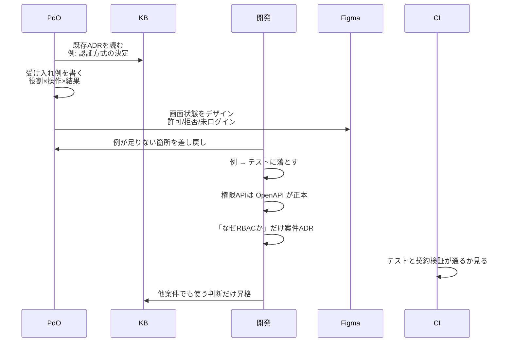
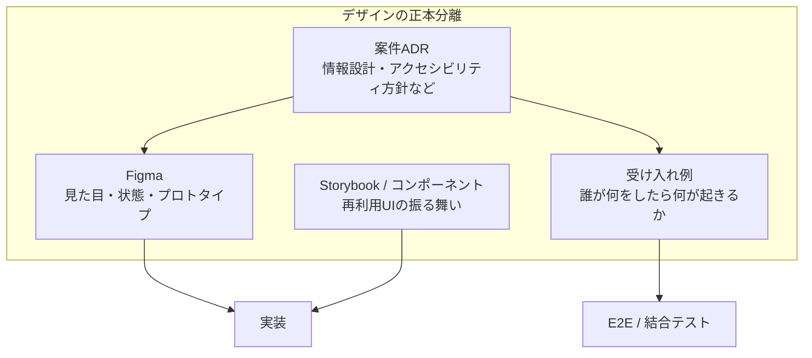

## いつ使うか

AIDD の文書分担（KB / 案件スペック / 実装）が抽象的でピンとこないとき。大規模プロジェクトで複数機能を同時リリースする前提を、置き場の図として共有したいとき。UI デザインの正本をどこに置くか迷い、詳細設計 Markdown に画面を写し始めそうなとき。

本手順の具体例は次の 4 機能を想定する（名前は差し替えてよい）。

- 権限管理
- 棚卸
- ユーザーグループ
- 中間サーバー

## 手順

### 1. 置き場を 3 つに固定する

「全部を一つの Markdown 山にする」のではなく、正本の置き場を先に宣言する。



| 置き場所 | 何が残るか | 何は置かないか |
| --- | --- | --- |
| この KB（aidd） | 横断で効く決定（ADR）、根拠（EVID）、繰り返し手順（PB） | 案件固有の画面仕様・DDL 写し・実装詳細 |
| 案件の spec / 実装リポジトリ | ビジネススペック（例付き）、契約定義、案件限りの ADR、テスト、Figma へのリンク | KB の全履歴のコピー |
| コード正本 | 振る舞い＝テスト、契約＝機械可読定義、UI 部品＝コンポーネント | 「詳細設計書への同じ内容の再掲」 |

日々の作業は案件リポ側。KB は「次の案件でも使う判断」だけが増える（[ADR-00008](../adr/00008-sdd-bridge.md)）。

### 2. 機能ごとに厚みを変える

4 機能を同じ厚さの設計書で書かない。性質で振り分ける（[ADR-00014](../adr/00014-implementation-spec-split.md)、[PB-00012](00012-triage-implementation-spec.md)）。



| 機能 | ビジネススペック（例） | 文書に残す決定 | 書かないもの |
| --- | --- | --- | --- |
| 権限管理 | 「Viewer は棚卸一覧は見れるが確定は 403」 | 権限モデル（RBAC vs ABAC）、トークンと権限の解決順 | 全画面のレイアウト説明 |
| ユーザーグループ | 「グループ A のメンバーは棚卸チーム X に自動所属」 | グループと権限の関係（包含？交差？） | メンバー追加 UI のピクセル指定 |
| 棚卸 | 「未確定のまま月末跨ぎ → 翌月に繰越／エラー」 | 状態遷移で不可逆なものだけ | 「画面遷移図の全部」 |
| 中間サーバー | 「上流タイムアウト時はリトライ 2 回、その後は失敗を返す」 | 同期/非同期、認証方式、障害時契約 | 内部クラス構成の詳細 |

### 3. 1 機能の流れを権限管理で試す



受け入れ例は [templates/acceptance-examples.md](../templates/acceptance-examples.md) を案件リポへコピーして埋める。要件から例まで詰める往復（エージェントが問い、PdO が決める。各行に出所、記録は `acceptance-refinement-log.md`）は [PB-00020](00020-refine-acceptance-from-design.md)、例からテストへは [PB-00013](00013-start-tdd-from-examples.md)。権限管理の行の例:

| # | 入力 | 期待 |
| --- | --- | --- |
| 1 | 役割=Viewer, 操作=棚卸確定 | 403、画面は「権限がありません」 |
| 2 | 役割=Operator, 操作=棚卸確定, 自分の担当店舗 | 200、状態が confirmed |
| 3 | 役割=Operator, 操作=棚卸確定, 他店舗 | 403 |

この表がテストになり、Figma では「403 のとき何を見せるか」を描く。Markdown に画面仕様を長文で書かない。

### 4. 案件リポのディレクトリを切る

例（名前はプロジェクトに合わせる）:

```text
product-repo/
  specs/
    authz/                             # 権限管理
      acceptance-examples.md
      acceptance-refinement-log.md     # 例を詰めた巡の指摘と対応（PB-00020）
      adr/00001-rbac-model.md            # 案件限りの決定
    user-groups/
      acceptance-examples.md
      adr/00001-group-membership.md
    inventory/                         # 棚卸
      acceptance-examples.md
      # 厚い design.md は作らない
    edge-proxy/                        # 中間サーバー
      acceptance-examples.md
      adr/00001-timeout-retry.md
      openapi.yaml                     # 契約の正本
  apps/
    web/
    edge-proxy/
  tests/...

aidd/                                  # 知識ベース（別リポ）
  adr/0xx-prefer-rbac-for-b2b.md       # 横断決定だけ
  evidence/...
  playbook/...
```

案件の `specs/authz/adr/001-...` と KB の `adr/0xx-...` は別物。前者はこの製品のこのリリース、後者は再利用する判断。KB へ戻すときは [PB-00008](00008-bridge-sdd-spec.md) と [templates/sdd-handoff.md](../templates/sdd-handoff.md) を使う。

### 5. デザインの正本を分ける

UI デザイン専用の ADR はまだない。ここでは [ADR-00014](../adr/00014-implementation-spec-split.md) の「契約・決定・振る舞い」分解を UI に当てる（正式なデザイン方針 ADR 化は [OQ-00028](../ledger/open-questions.md)）。

| デザインの中身 | 正本 | KB / Markdown に書く？ |
| --- | --- | --- |
| 見た目・レイアウト・余白 | Figma | 書かない。リンクだけ |
| 画面状態（空・読込・権限なし・エラー） | Figma の variants + 受け入れ例 | 状態名と期待結果だけ例に書く |
| コンポーネントの振る舞い | Storybook / コンポーネントテスト | 書かない |
| デザイントークン（色・余白・型） | コード（tokens）または Design System リポ | 書かない |
| 「なぜこの情報設計か」「アクセシビリティを WCAG 2.2 AA にする」 | 案件 ADR（横断なら KB の ADR） | 決定だけ書く |
| 画面遷移の全部 | 基本書かない | 不可逆な導線制約だけ ADR |



運用ルール:

1. 絵は Figma、正しさは受け入れ例とテスト、理由だけ ADR
2. Figma と Markdown に同じ画面説明を二重に持たない
3. 「画面で何が正しいか」は受け入れ例の状態行に落とす（例: 権限なし → 編集ボタン非表示。URL 直打ちなら 403 ページ）

### 6. 週次の作業表で 4 機能を並走させる

| 週の作業 | 権限 | グループ | 棚卸 | 中間サーバー | デザイン |
| --- | --- | --- | --- | --- | --- |
| 計画 | 役割×操作の表を埋める | 所属ルールの例 | 状態×境界の例 | タイムアウト/再試行の例 | 状態バリアントを Figma に作る |
| 実装前 | RBAC を案件 ADR 化 | グループと権限の関係を ADR 化 | 不可逆遷移だけ ADR | 契約を OpenAPI 化 | トークンはコード側へ |
| 実装 | API + テスト | API + テスト | 業務テスト中心 | 契約テスト + 障害系 | コンポーネント実装 |
| 完了後 | 「RBAC を標準にする」等だけ KB へ | 案件固有なら戻さない | 戻さないことが多い | 障害時方針が汎用なら KB へ | 見た目は KB に入れない |

## 検証

- 案件リポに「全機能共通の厚い詳細設計.md」がなく、機能ごとに受け入れ例がある
- 残った ADR 各項目に、共有境界・不可逆・選択肢ありのいずれかが対応づく（[PB-00012](00012-triage-implementation-spec.md)）
- 画面の見た目説明が Markdown に写経されておらず、Figma（または同等）へのリンクになっている
- 契約本文が OpenAPI / マイグレーション等にあり、Markdown に同じスキーマが貼られていない
- KB に上げたものは「他案件でも繰り返す判断」だけであり、[PB-00008](00008-bridge-sdd-spec.md) の境界チェックを満たす

## 失敗時

- 「結局全部 Markdown に書いている」→ 手順 1 の表に戻し、各段落を契約・決定・振る舞い・見た目のどれかにラベルして正本へ移す
- 実装スペックだけが厚い → 上流の受け入れ例不足のサイン。PdO に [templates/acceptance-examples.md](../templates/acceptance-examples.md) を渡す（[ADR-00014](../adr/00014-implementation-spec-split.md)）
- デザイン方針（アクセシビリティ水準、Design System の置き場など）でチームが割れる → 案件 ADR に決定を残す。横断で繰り返すなら KB 昇格を検討し、未決なら [OQ-00028](../ledger/open-questions.md) を更新する
- KB と案件 ADR のどちらに書くか迷う → 「次案件でも同じ判断か？」だけで切る。No なら案件側（[ADR-00008](../adr/00008-sdd-bridge.md)）

## 関連

- [ADR-00008](../adr/00008-sdd-bridge.md)
- [ADR-00014](../adr/00014-implementation-spec-split.md)
- [PB-00008](00008-bridge-sdd-spec.md)
- [PB-00012](00012-triage-implementation-spec.md)
- [PB-00013](00013-start-tdd-from-examples.md)
- [templates/acceptance-examples.md](../templates/acceptance-examples.md)
- [templates/sdd-handoff.md](../templates/sdd-handoff.md)
- [GUIDE.md](../GUIDE.md)
- [OQ-00028](../ledger/open-questions.md)
